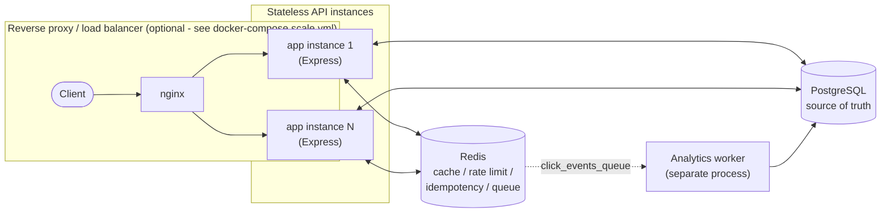
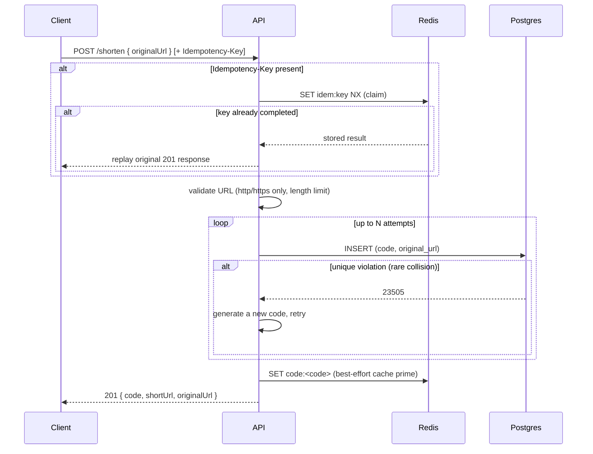
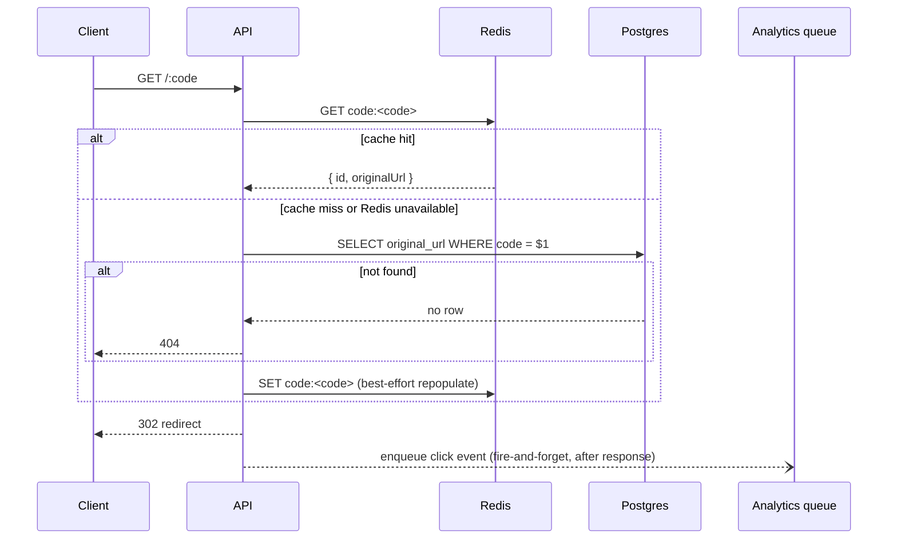
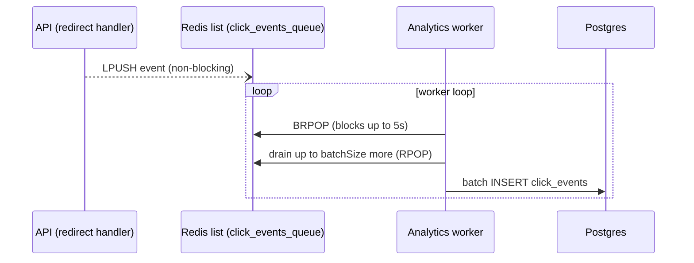

# Scalable URL Shortener

A URL shortener built as a system-design/backend-engineering portfolio project: Node.js + Express, PostgreSQL as the source of truth, Redis as an optional cache/rate-limiter/idempotency store, and an async worker for click analytics.

The project started as a ~90-line Express prototype (create a short code, redirect, cache in Redis). This repo is that same idea, hardened: real failure-mode handling, idempotent creation, rate limiting, async analytics, tests run against real Postgres/Redis, and a Docker Compose stack that actually starts up cleanly from a fresh clone.

## Table of contents

1. [Why this project exists](#why-this-project-exists)
2. [Features](#features)
3. [Architecture](#architecture)
4. [Request flows](#request-flows)
5. [Database design](#database-design)
6. [Redis caching strategy](#redis-caching-strategy)
7. [Rate limiting strategy](#rate-limiting-strategy)
8. [Idempotency strategy](#idempotency-strategy)
9. [Analytics architecture](#analytics-architecture)
10. [Failure handling](#failure-handling)
11. [API documentation](#api-documentation)
12. [Local setup](#local-setup)
13. [Docker setup](#docker-setup)
14. [Testing](#testing)
15. [Load testing](#load-testing)
16. [Engineering tradeoffs](#engineering-tradeoffs)
17. [Future improvements](#future-improvements)

## Why this project exists

URL shortening is a small enough problem to build end-to-end and a good enough problem to demonstrate real backend engineering judgment: caching, cache invalidation and staleness, idempotency, rate limiting, graceful degradation when a dependency fails, and asynchronous processing. This project deliberately stays a single, well-structured backend rather than growing into microservices - the goal is depth on a small surface area, not technology breadth.

## Features

- Create short URLs (`POST /shorten`) with strict `http(s)`-only validation and a length limit
- Redirect (`GET /:code`) via Redis cache-aside with Postgres fallback
- Server-side short-code collision retry (bounded, transparent to the client)
- `Idempotency-Key` support for safe retries of `POST /shorten`
- Redis-backed rate limiting on `POST /shorten`, fails open if Redis is down
- Asynchronous click analytics (`GET /urls/:code/analytics`) via a Redis queue + background worker, never on the redirect's critical path
- Liveness/readiness health checks (`/health/live`, `/health/ready`) with documented semantics
- Structured JSON logging with a request ID on every request
- Full Docker Compose stack (Postgres, Redis, app, worker, one-shot migration job) that starts from a clean clone
- 53 automated tests (unit + integration, run against real Postgres/Redis, not mocks) - see [Testing](#testing)
- A horizontal-scaling demo: two API instances behind nginx, verified to both receive traffic - see [docker-compose.scale.yml](docker-compose.scale.yml)

## Architecture



Every API instance is stateless: no in-memory session state, no local caching that isn't also in Redis. Two instances can run side by side sharing the same Postgres/Redis, and both correctly serve traffic - this is demonstrated, not just asserted; see [Horizontal scaling demo](#horizontal-scaling-demo).

### Module structure

```
src/
  config/          single source of truth for env vars (src/config/index.js)
  db/              Postgres connection pool (src/db/pool.js)
  cache/           Redis client + safe wrappers that never throw (src/cache/redisClient.js, urlCache.js)
  repositories/     all SQL lives here (urlRepository.js, analyticsRepository.js)
  services/        business logic (urlService.js, idempotencyService.js, analyticsService.js)
  controllers/     thin HTTP glue (urlController.js, analyticsController.js, healthController.js)
  routes/          Express routers
  middleware/      rateLimiter.js, errorHandler.js, requestLogger.js
  queue/           eventQueue.js - push analytics events without blocking the response
  workers/         analyticsWorker.js - separate process, drains the queue into Postgres
  utils/           validation, error types, logger, short code generation
  app.js           Express app assembly (no side effects - safe to import in tests)
  server.js        process entrypoint (binds the port)
db/
  migrations/      version-controlled SQL (001_create_urls.sql, 002_create_click_events.sql)
  migrate.js       minimal migration runner, idempotent, applied on every container start
tests/
  unit/            mocked, no infra required
  integration/     real HTTP requests against real Postgres + Redis (see Testing)
  load/            autocannon-based load test harness
```

## Request flows

### URL creation



### Redirect



### Analytics



## Database design

PostgreSQL is the **source of truth** for every mapping; Redis never is. Schema lives in [db/migrations/](db/migrations/), applied by [db/migrate.js](db/migrate.js) (idempotent - tracks applied files in a `schema_migrations` table, safe to run on every container start).

**`urls`** ([001_create_urls.sql](db/migrations/001_create_urls.sql))
- `id BIGSERIAL PRIMARY KEY`
- `code VARCHAR(16) NOT NULL UNIQUE` - the `UNIQUE` constraint is what makes server-side collision detection work (a duplicate insert throws Postgres error `23505`, caught in [urlRepository.js](src/repositories/urlRepository.js))
- `original_url TEXT NOT NULL`, capped at 2048 chars via a `CHECK` constraint
- `created_at`, `updated_at TIMESTAMPTZ`

**`click_events`** ([002_create_click_events.sql](db/migrations/002_create_click_events.sql))
- `id BIGSERIAL PRIMARY KEY`
- `url_id BIGINT REFERENCES urls(id) ON DELETE CASCADE`
- `code VARCHAR(16)`, `occurred_at TIMESTAMPTZ`
- `referrer TEXT`, `user_agent TEXT`
- `ip_hash CHAR(64)` - a SHA-256 hash of the client IP, **never the raw IP** (see [Security](#security-review) in the final review)
- indexed on `code` (analytics reads are always "all clicks for this code") and `occurred_at`

**How a redirect actually reads/writes data:** see the sequence diagram above. Short version - Redis first (cache-aside), Postgres on miss, and the code/original_url pair is small enough (well under Redis's typical value-size sweet spot) that caching it whole is cheap. The `urls.code` `UNIQUE` constraint already provides a btree index for the redirect's lookup; no extra index was needed there.

**Known bottleneck at scale:** everything is one Postgres primary. There's no read replica, no sharding. For a real high-traffic deployment, Redis cache-hit rate matters enormously for keeping load off that single primary - see [LOAD_TEST_RESULTS.md](LOAD_TEST_RESULTS.md) for real numbers.

## Redis caching strategy

Cache-aside, TTL-based (`CACHE_TTL_SECONDS`, default 1 hour). Cache value is JSON `{ id, originalUrl }` (not a bare string) so a cache **hit** on the redirect path still has the `url_id` needed to record a click event, without an extra Postgres round trip just to get an id.

**The one rule everything else follows: Redis is an optimization, never a hard dependency for correctness.** Every Redis call in the app goes through `src/cache/redisClient.js`'s `safe*` wrappers, which catch errors/timeouts (150ms command timeout, `enableOfflineQueue: false` so a down Redis fails fast instead of queueing forever) and return a sentinel instead of throwing. `urlService.resolveCode` treats "confirmed miss" and "Redis failed" identically - both fall back to Postgres. This is verified, not just asserted: see [Failure handling](#failure-handling) below for a real recorded test of stopping the Redis container mid-traffic.

## Rate limiting strategy

Fixed-window counter via Redis `INCR` + `EXPIRE NX`, applied to `POST /shorten` only ([src/middleware/rateLimiter.js](src/middleware/rateLimiter.js)). Default: 20 requests / 60 seconds / client IP (`RATE_LIMIT_MAX_REQUESTS`, `RATE_LIMIT_WINDOW_SECONDS`).

**Why fixed-window and not sliding-window-log:** fixed-window allows up to ~2x the configured rate at a window boundary (a burst at the end of one window plus a burst at the start of the next). A sliding-window-log (Redis sorted set) is more precise but costs more Redis round trips per request. For a single write endpoint on a project this size, that precision isn't worth the extra complexity - stated as a tradeoff, not hidden.

**Fail-open, deliberately:** if Redis is unavailable, the limiter can't count requests, so it lets the request through rather than blocking all traffic because of a cache outage. Rate limiting is an abuse-prevention control, not a correctness guarantee - keeping Redis optional here is consistent with the caching rule above. This was actually observed during integration testing (see logs: `"Rate limiter unavailable (Redis down); failing open"` fires for the very first request in a fresh test process, before the Redis connection reaches `ready`) - real evidence the fail-open path works, not a hypothetical.

## Idempotency strategy

`POST /shorten` accepts an `Idempotency-Key` header. Design (`src/services/idempotencyService.js`):

1. `SET idem:<key> {"status":"processing"} EX <lockTtl> NX` - atomic claim. Only one concurrent request with the same key can win this.
2. The loser of that race is told `409 IDEMPOTENCY_IN_PROGRESS` - the honest answer, not a silent duplicate-suppression that pretends nothing happened.
3. On success, the claim is overwritten with `{"status":"completed", response, statusCode}` at a much longer TTL (`IDEMPOTENCY_RESULT_TTL_SECONDS`, default 24h) - a retried request with the same key replays the exact original response instead of creating a second short URL.
4. On failure, the claim is deleted so a legitimate retry isn't stuck for the full lock TTL.
5. **If Redis is unavailable, idempotency is best-effort only** - the request proceeds as a normal (non-deduplicated) create. This is the same "Redis is optional" rule applied here: the alternative (blocking creation because the dedup store is down) would make Redis a hard dependency, which the project's design explicitly avoids.

This is tested against real Redis with genuinely concurrent requests (`Promise.all` of two identical requests with the same key) in `tests/integration/idempotency.test.js` - the test asserts only one of the two ever produces a new code, which is the actual race the design has to resolve correctly.

## Analytics architecture

Click events must never slow down or fail a redirect. The redirect handler pushes a JSON event onto a Redis list (`click_events_queue`) via `LPUSH`, **without awaiting it** before sending the 302 response (`src/controllers/urlController.js` → `src/queue/eventQueue.js`). A separate worker process (`src/workers/analyticsWorker.js`, `npm run worker` / the `worker` service in `docker-compose.yml`) blocks on `BRPOP`, drains up to `ANALYTICS_WORKER_BATCH_SIZE` events at a time, and batch-inserts them into `click_events`.

**Why a Redis list and not Kafka/RabbitMQ/SQS:** the actual requirement is "decouple the redirect from the Postgres write" - a single list satisfies that completely. A dedicated broker would add real operational surface (another service to run, monitor, and reason about) for no corresponding benefit at this project's scale.

**Delivery semantics: at-most-once.** If the worker crashes between `BRPOP` and the Postgres insert, that one event is lost. Click analytics is not a billing or audit system - this tradeoff is stated, not glossed over.

`GET /urls/:code/analytics` returns total clicks, first/last click timestamps, and top referrers (`src/repositories/analyticsRepository.js`).

## Failure handling

This is the section the whole design optimizes for, so it's backed by real observed behavior, captured directly from the running Docker stack (`docker compose stop <service>` while sending live `curl` requests - not just described):

| Scenario | Observed result |
|---|---|
| Redis stopped, redirect on a code | `302` - Postgres fallback works, exactly as designed |
| Redis stopped, `POST /shorten` | `201` - creation still durable, cache priming just skipped |
| Redis stopped | `GET /health/ready` → `200 {"status":"ready","dependencies":{"postgres":"up","redis":"down"}}` - correctly stays in rotation |
| Postgres stopped, redirect on an uncached code | `500 {"error":{"message":"Server error","code":"INTERNAL_ERROR"}}` - correctly fails (Postgres is the one hard dependency) |
| Postgres stopped | `GET /health/ready` → `503 {"status":"not_ready","dependencies":{"postgres":"down","redis":"up"}}` - correctly pulled from rotation |
| Both restarted | Full recovery, `/health/ready` back to `200` within a few seconds |

**Race conditions:** the idempotency claim uses atomic `SET NX`, so two concurrent identical requests can't both "win" - verified under real concurrency in `tests/integration/idempotency.test.js`. Short-code collisions are handled the same way collisions on `INSERT` are always handled correctly by a database: the `UNIQUE` constraint is the actual source of truth, and the app just retries on top of it.

**What's not covered:** no retry-with-backoff on transient Postgres errors (a single failed query fails the request); no circuit breaker pattern; no distributed tracing across the worker and API. See [Future improvements](#future-improvements).

## API documentation

All responses are JSON except the redirect itself. Errors share one shape: `{ "error": { "message": "...", "code": "SOME_CODE" } }`.

### `POST /shorten`

Create a short URL.

**Headers:** `Content-Type: application/json`, optional `Idempotency-Key: <any string>`

**Body:** `{ "originalUrl": "https://example.com/..." }`

**Responses:**
- `201` - `{ "code": "abc1234", "originalUrl": "...", "shortUrl": "http://.../abc1234", "createdAt": "..." }`
- `400 VALIDATION_ERROR` - missing/malformed URL, unsupported protocol, or over the length limit
- `409 IDEMPOTENCY_IN_PROGRESS` - another request with the same `Idempotency-Key` is still processing
- `429 RATE_LIMITED` - rate limit exceeded (`Retry-After` header set)
- `503 COLLISION_RETRIES_EXHAUSTED` - extremely unlikely; server-side collision retries were exhausted

### `GET /:code`

Redirect to the original URL.

**Responses:** `302` redirect, or `404 NOT_FOUND`

### `GET /urls/:code/analytics`

**Responses:** `200` - `{ code, originalUrl, totalClicks, firstClickedAt, lastClickedAt, topReferrers: [{ referrer, clicks }] }`, or `404 NOT_FOUND`

### `GET /health/live`

Always `200 {"status":"ok"}` if the process is up. Never checks dependencies (see [src/controllers/healthController.js](src/controllers/healthController.js) for why).

### `GET /health/ready`

`200` if Postgres is reachable (required), regardless of Redis status. `503` if Postgres is down. Response always reports both: `{ "status": "ready"|"not_ready", "dependencies": { "postgres": "up"|"down", "redis": "up"|"down" } }`.

## Local setup

Requires Node 22+, and either Docker (recommended) or local Postgres 16 + Redis 7.

```bash
git clone <this-repo>
cd "Scalable URL Shortener"
cp .env.example .env
npm install

# Option A: infra via Docker, app on host
docker compose up -d postgres redis
npm run migrate
npm run dev            # API on :3000
npm run worker:dev      # in a second terminal

# Option B: everything in Docker (see below)
```

## Docker setup

```bash
docker compose up --build
```

This starts, in order: `postgres` and `redis` (with real health checks, not just "container started"), then a one-shot `migrate` job that applies `db/migrations/*.sql` and exits, then `app` and `worker` - both of which wait for `migrate` to exit successfully (`condition: service_completed_successfully`), not just for Postgres to accept connections. That distinction matters: "Postgres is accepting connections" is not the same as "the schema exists," which was the exact gap in the original prototype (no schema was ever checked into the repo).

API on `http://localhost:3000`. Verified end-to-end on this machine: `docker compose up --build` → `curl -X POST localhost:3000/shorten` → `curl localhost:3000/<code>` (302) → `curl localhost:3000/urls/<code>/analytics` (shows the click) all work from a clean `docker compose down -v`.

### Horizontal scaling demo

```bash
docker compose -f docker-compose.yml -f docker-compose.scale.yml up --build
```

Runs two independent app instances (`app`, `app2` - same image, same code, no shared local state) behind nginx on `:8080`. Verified for real: sending repeated requests to `:8080/health/live` and grepping each container's own logs shows both `app` and `app2` receiving traffic, confirming the API is genuinely stateless and horizontally scalable, not just "designed to be." See `nginx/nginx.conf` for the (deliberately minimal) round-robin config.

## Testing

```bash
npm run test:unit          # 33 tests, mocked, no infra needed, ~1-8s
docker compose up -d postgres redis && npm run migrate
npm run test:integration    # 20 tests, real Postgres + Redis, not mocks
npm test                    # both together - 53 tests, all passing as of this writing
```

Integration tests genuinely exercise the HTTP app (via `supertest`) against real Postgres and Redis - not `pg-mem` or `ioredis-mock` - because the actual claims worth testing here (graceful Redis degradation, real collision retries under a live unique constraint, real concurrent idempotency races) can't be honestly verified against a mock of the thing they're about.

**What's covered:**
- URL creation: valid/missing/malformed URL, unsupported protocol, over-length URL, successful creation, no implicit dedup across separate requests
- Collision handling: simulated collision + automatic retry, retry exhaustion (unit, via mocked repository - a real Postgres collision at nanoid(7)'s keyspace isn't practical to trigger organically)
- Redirect: cache hit, cache miss + Postgres fallback + repopulation, Redis failure fallback (unit-level, via a `SENTINEL_FAILURE` mock), nonexistent code
- Idempotency: repeated key returns the original result, concurrent identical requests resolve to exactly one winner, different keys create independent URLs, no-key behaves normally
- Rate limiting: under limit, limit exceeded (exact boundary - `LIMIT` successes then `429`s), `Retry-After` header present
- Analytics: event generation on redirect, background worker processing (using the worker's own `runOnce()` function, not a mocked queue), aggregation via the analytics endpoint, zero-click case
- Health: liveness always 200, readiness reports both dependencies

**What isn't automated (verified manually instead, see [Failure handling](#failure-handling)):** stopping the Postgres/Redis *containers* mid-request. Doing that reliably inside Jest would mean shelling out to `docker compose stop` from within a test, which is fragile and slow; instead it was verified directly against the running Docker stack with real `curl` requests, and the exact observed output is recorded above rather than assumed.

## Load testing

See [LOAD_TEST_RESULTS.md](LOAD_TEST_RESULTS.md) for full real, captured `autocannon` output (redirect cache-hit, redirect cache-miss, raw creation throughput, and rate-limited traffic), plus the methodology and its caveats (single machine, one run per scenario, no isolated benchmarking environment). Re-run any scenario yourself:

```bash
docker compose up -d --build
node tests/load/run.js redirect-hit
node tests/load/run.js redirect-miss
node tests/load/run.js shorten
node tests/load/run.js rate-limited
```

## Engineering tradeoffs

**Why PostgreSQL?** Strong consistency for the one thing that must never be wrong (the code → URL mapping), simple relational schema, mature tooling. Nothing about this problem needs a NoSQL store's flexibility.

**Why Redis?** It's the natural fit for three unrelated jobs this project has (cache, rate-limit counter, idempotency claim store) without adding three different pieces of infrastructure - and its failure modes are well understood, which matters given the whole project pivots on "Redis can die without the app dying."

**Why nanoid over a counter/Snowflake ID?** Random codes need no central coordination to generate (any instance can mint one independently), which matters for horizontal scaling. The cost is needing collision handling - implemented and tested (see [Idempotency/collision](#robust-url-creation) work in `urlService.createShortUrl`).

**Why cache-aside over write-through/write-behind?** Cache-aside keeps Redis genuinely optional - the app works, just slower, with it gone. Write-through would tie every write to Redis being up, contradicting the project's core reliability requirement.

**Why asynchronous analytics over synchronous?** A redirect is the highest-traffic, most latency-sensitive path in the whole system; nothing non-essential should be allowed to slow it down or make it fail. This is why click events are pushed, not awaited.

**Why not microservices?** Nothing here has an independent scaling profile, deployment cadence, or team boundary that would justify the operational cost of splitting it up. One well-structured Express app with a clean layered internal architecture achieves the same separation of concerns without the network hops.

**Why not Kafka (or similar) for analytics?** The actual requirement - decouple the write from the request - is fully satisfied by a Redis list. Kafka would add partitioning, consumer groups, and an entire second piece of infrastructure to operate, for a workload (a single-table, at-most-once click log) that doesn't need any of that.

**Why not Kubernetes?** The horizontal-scaling concept (stateless instances behind a load balancer, sharing Postgres/Redis) is demonstrated with plain Docker Compose + nginx, which is honest about what's actually being shown: the *application* is stateless, not "here's a Kubernetes deployment." Adding k8s would demonstrate YAML authoring, not anything about this app's own scalability properties.

## Future improvements

Explicitly not implemented, and not claimed to be:

- Postgres read replicas / connection pool tuning under real concurrent load
- Retry-with-backoff for transient Postgres errors (currently: single attempt, fails the request)
- A circuit breaker in front of Postgres calls
- Per-user accounts / ownership of short URLs (currently fully anonymous, like the original prototype)
- Custom short codes (currently always auto-generated)
- Link expiration / deletion
- A proper sliding-window rate limiter (current fixed-window allows boundary bursts, tradeoff explained above)
- Distributed tracing across the API and the analytics worker
- Multi-region deployment
